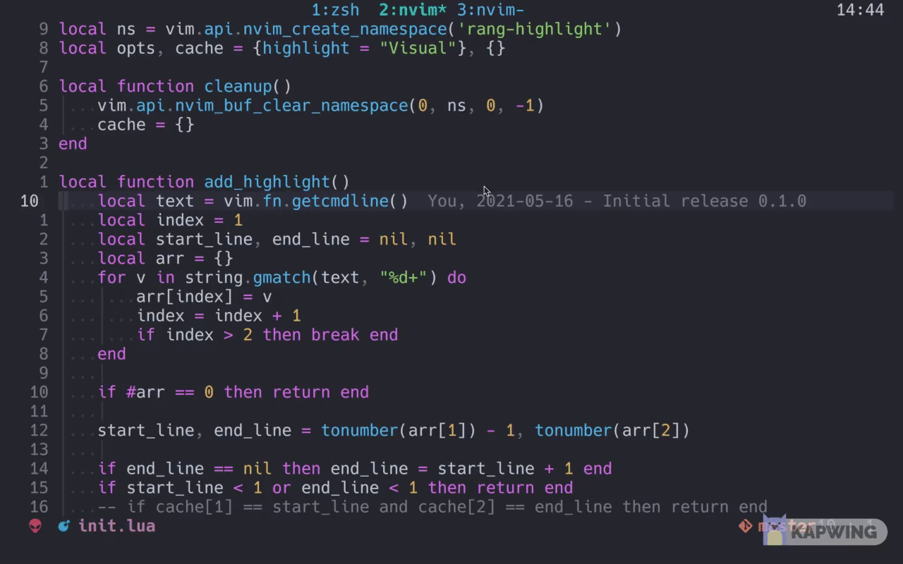

# range-highlight.nvim

An extremely lightweight plugin (~ 60loc) that hightlights ranges you have entered in commandline.



## Features

- Single line range highlight (`:10`)

- Absolute range highlight (`:20,15`)

- Backward range highlight (`:20,15`)

- Shorthand range highlight (`:,15`)

- Relative range highlight (`:+5,-2`) (**WIP**)

## Installation

### `paq.nvim`

```lua
paq{'winston0410/range-highlight.nvim'}
require'range-highlight'.setup{}
```

## Configuration

This is the default configuration. It is likely that you don't need to change anything.

```lua
require("range-highlight").setup {
    highlight = "Visual"
}
```

## Acknowledgement

Thank you folks from [gitters](https://gitter.im/neovim/neovim) for helping me out with this plugin.
